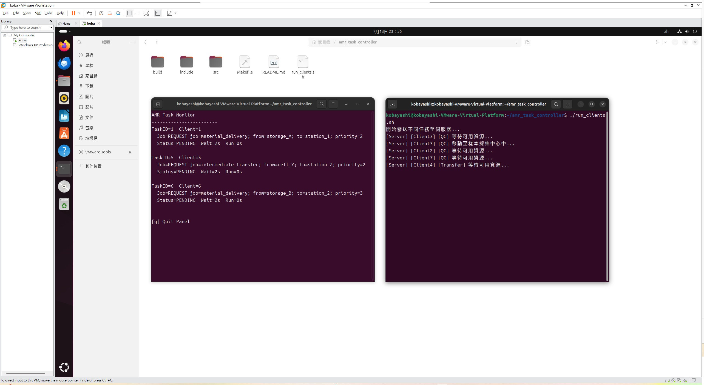

# AMR Task Controller

本專案為一套模擬 AMR（自主移動機器人）任務排程系統的簡易框架，模擬多個 client 向 server 並發送任務，並透過 semaphore 控制共享資源的使用上限。  
具備任務優先級佇列、dispatcher、CLI 測試腳本、ncurses UI，以及 Docker 容器化支援，方便跨平台測試與部署。

---

## 📁 專案結構

```
amr_task_controller/
├── include/            # 標頭檔（job_handler.h, task_queue.h, ui_ncurses.h）
├── src/                # 程式原始碼（main.c, job_handler.c, task_queue.c, client.c, ui_ncurses.c）
├── build/              # 編譯輸出檔案（server, client）
├── assets/             # 截圖示意（ScreenShot.png）
├── run_clients.sh      # 測試腳本（模擬多個 client 發送任務）
├── Makefile            # 編譯規則
├── Dockerfile.server   # Server 容器建構檔
├── Dockerfile.client   # Client 容器建構檔
├── docker-compose.yml  # 多容器設定檔
└── README.md           # 專案說明文件
```

---

## 🚀 使用說明（本機）

### 1️⃣ 編譯專案

```bash
make
```

### 2️⃣ 啟動 Server（含 ncurses UI）

```bash
./build/server
```

### 3️⃣ 模擬單一 Client 發送任務

```bash
./build/client "REQUEST job=material_delivery; from=storage; to=station1" 2
```

### 4️⃣ 模擬多 Client 發送任務（腳本）

```bash
./run_clients.sh
```

---

## 🐳 使用說明（Docker 容器模式）

**Server 執行於 Host，Client 使用 container 模擬多端發送任務**

### 建立與啟動容器

```bash
docker compose up --build
```

### 啟動後，你可使用互動式 CLI 操作任一 client container：

```bash
docker exec -it amr_task_controller-client1-1 /bin/bash
./build/client "REQUEST job=intermediate_transfer; from=A; to=B" 3 172.17.0.1
```

（可根據實際 server IP 調整最後一個參數）

---

## 🧠 任務排程邏輯與資源設定

- `cargo_sem`: 最多允許 **3** 個 Cargo 任務（material_delivery / intermediate_transfer）同時執行
- `qc_sem`: 最多允許 **1** 個 QC 任務（sample_collection）同時執行
- Cargo 任務會依據 priority 進入 **優先級佇列**，由 Dispatcher Thread 負責處理

### 任務類型與資源對應

| 任務名稱               | 描述                             | 使用 semaphore |
|------------------------|----------------------------------|----------------|
| `material_delivery`     | 將物料從倉儲區送至工作站          | `cargo_sem`    |
| `intermediate_transfer` | 在製程單元間搬運半成品            | `cargo_sem`    |
| `sample_collection`     | 採集樣本至 QC 檢測站              | `qc_sem`       |

---

## 🖥️ ncurses UI：即時任務監控介面

Server 啟動後將進入文字介面顯示任務狀態：

- 任務 ID / Client 編號 / 任務敘述
- 狀態（Pending / Running / Done）
- 等待時間與執行時間

📌 **按下 `q` 可退出畫面**

---

## ✅ 已完成功能

- [x] 任務佇列（含優先級）與 dispatcher thread
- [x] 任務分類與 semaphore 資源控制
- [x] 多 client CLI 模擬發送任務
- [x] ncurses UI 顯示任務狀態
- [x] Docker 容器化（server+client）
- [x] 跨主機連線支援（client 可指定 server IP）

---

## 🧩 可擴充功能（規劃中）

- [ ] **Web UI 控制台**（以瀏覽器即時查詢與操作）

---

## 📷 執行畫面示意



---

## 🔖 License

MIT License - feel free to use or modify for academic or research purposes.


